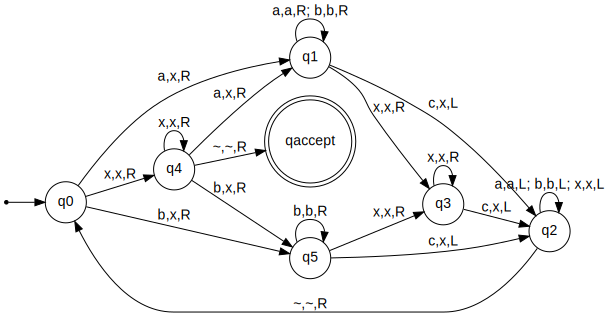

# Práctica de MTs



## 


## Instrucciones

Instalar:

- python 3.9
- pip
- virtualenv

La primera vez:

```bash
python -m venv venv
``` 

## Para ejecutar

Antes de arrancar a trabajar hay que activar el entorno virtual

En Windows:

```bash
venv\Scripts\activate
pip install -r requirements.txt
```

En Linux:

```bash
. venv/bin/activate
pip install -r requirements.txt
```

Una vez activado el entorno virtual corremos los tests:

```
python -m pytest
```

## La tarea

El trabajo está completo cuando hayamos implementado la MT misteriosa en el archivo maquina.py y todos los tests den verde.

¡Éxitos!
